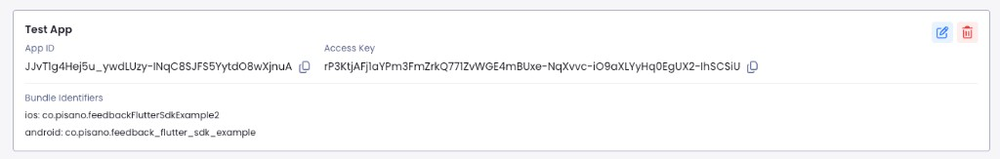
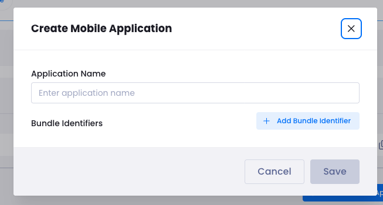
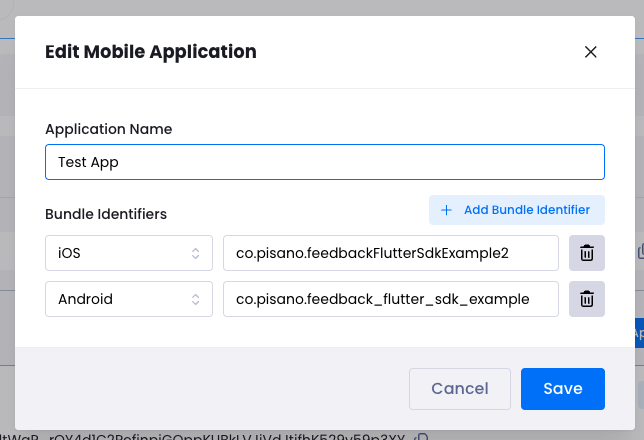
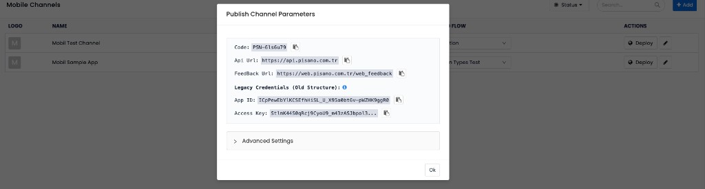

# Feedback iOS SDK (Sample Apps)

Pisano Feedback iOS SDK helps you collect surveys and user feedback in your iOS applications.

> This repository is a **sample app repo**. The **SDK source code is not in this repo**.

**Primary sample for most production-style apps:** use the **UIKit** project **`pisano-ios-sdk-sample-app-uikit`** (App lifecycle, `UIViewController`, storyboard/XML-style UI in Swift). The **SwiftUI** project is an equivalent alternative with the same SDK calls.

## ✅ Sample apps in this repo

- **UIKit (Swift) — recommended baseline**: `pisano-ios-sdk-sample-app-uikit/pisano-ios-sdk-sample-app.xcodeproj`
- **SwiftUI sample**: `pisano-ios-sdk-sample-app/pisano-ios-sdk-sample-app.xcodeproj`

SDK module/product name used by these samples: **`PisanoFeedback`** (version **1.0.21**)

## MT-41 — Bottom sheet `dismissOnDrag` (sample UI)

Both sample projects include **Dismiss on drag (Off/On)** on the form screen:

| Project | UI control |
|---------|------------|
| `pisano-ios-sdk-sample-app-uikit` | Segmented control |
| `pisano-ios-sdk-sample-app` (SwiftUI) | Toggle |

Value is forwarded via `FeedbackManager.showFlow(..., dismissOnDrag:)` → `Pisano.show(...)`.

Details: [RELEASE_NOTES_1.0.21.md](./RELEASE_NOTES_1.0.21.md)

## Pisano Feedback iOS SDK — v1.0.21 Release Notes

### What's new in v1.0.21

- **WebView zoom control (`disable_zoom`):** configurable per channel from Pisano panel; no app API change
- **Keyboard + viewport:** improved bottom sheet keyboard handling; survey scroll stays inside web widget
- **Includes:** bottom sheet `dismissOnDrag`, grabber, and all changes from **1.0.20**
- **Sample alignment:** Xcode projects resolve **`PisanoFeedback` 1.0.21** via Swift Package Manager
- **CocoaPods:** `pod 'Pisano', '~> 1.0.21'` — [cocoapods.org/pods/Pisano](https://cocoapods.org/pods/Pisano)
- **SPM:** pin tag **1.0.21** on `https://github.com/Pisano/pisano-ios.git`

**Breaking changes:** None

---

## Pisano Feedback iOS SDK — v1.0.20 Release Notes

### What's new in v1.0.20

- **Sample alignment:** This repository’s Xcode projects resolve **`PisanoFeedback` 1.0.20** via Swift Package Manager (`Package.resolved`).
- **For integrators on v1.0.17:** Treat **1.0.20** as a **maintenance / patch-level upgrade** on top of the v1.0.17 API: same `Pisano.boot` (required `code`), optional per-call `code` on `show` / `healthCheck`, **no `flowId`**, same `CloseStatus` behaviour for display rate / display once / passive survey paths. **Bump the dependency and rebuild**—no Swift API migration is required when you are already on **1.0.17**.
- **CocoaPods:** use `pod 'Pisano', '~> 1.0.21'`. If **1.0.20** is not yet listed on [cocoapods.org/pods/Pisano](https://cocoapods.org/pods/Pisano), use the latest version shown there or install via **SPM** until the pod is published.

Framework-level commit details: [Pisano/pisano-ios](https://github.com/Pisano/pisano-ios) tags.

---

### Breaking changes (only when migrating from **≤ v1.0.16**)

The following was introduced in **v1.0.17** and **still applies in v1.0.21**.

#### `code` is now required in SDK initialization

You must pass `code` when calling `Pisano.boot(...)`. This is your survey/channel code from the Pisano panel.

```swift
import PisanoFeedback

// Typically in AppDelegate / app startup
#if DEBUG
Pisano.debugMode(true) // optional, recommended during development
#endif

Pisano.boot(appId: "APP_ID",
           accessKey: "ACCESS_KEY",
           code: "YOUR_CODE", // required
           apiUrl: "https://api.pisano.co",
           feedbackUrl: "https://web.pisano.co/web_feedback",
           eventUrl: nil) { status in
    print(status.description)
}
```

#### `flowId` parameter removed

All public APIs now use `code` instead of `flowId`. Update every `show(...)` and `healthCheck(...)` call accordingly.

---

### API Reference (v1.0.21)

#### `Pisano.show()`

```swift
Pisano.show(
    mode: ViewMode = .default,                     // optional — .default or .bottomSheet
    title: NSAttributedString? = nil,              // optional — toolbar title
    language: String? = nil,                       // optional — e.g. "en", "tr"
    customer: [String: Any]? = nil,                // optional — customer info
    payload: [String: Any]? = nil,                 // optional — custom key-value data
    code: String? = nil,                           // optional — overrides boot code for this call
    dismissOnDrag: Bool = false,                   // optional — swipe-down dismiss when .bottomSheet
    completion: ((CloseStatus) -> Void)? = nil     // optional — result status
)
```

- **`dismissOnDrag`:** Default `false`. When `true` and `mode` is `.bottomSheet`, swipe-down dismiss is enabled.

- **`code` is optional on `show`.** The `code` you pass to **`Pisano.boot(..., code:)`** is saved as the **default** survey/channel for the SDK session.
- If you **do not** pass `code` to `show` (or you pass **`nil`**), the SDK **always** uses the **`code` from boot**—not some other implicit value.
- If you pass a **non-`nil`** `code` to `show`, that value **overrides the boot `code` for this call only**; the next `show` without `code` goes back to the boot default.

#### `Pisano.healthCheck()`

```swift
Pisano.healthCheck(
    language: String? = nil,                       // optional
    customer: [String: Any]? = nil,                // optional
    payload: [String: Any]? = nil,                 // optional
    code: String? = nil,                           // optional — overrides boot code for this call
    completion: ((Bool) -> Void)? = nil            // optional — true if reachable
)
```

- **`code` is optional on `healthCheck`.** Same rule as `show`: **omit or `nil` → use the `code` from `Pisano.boot`**; **non-`nil` → override for this call only**.

---

### New Features / Behavior Notes

#### Per-call `code` override

If your app shows multiple surveys, pass a `code` per call to be explicit:

```swift
// Uses boot code (from Pisano.boot) — `code` is optional; pass nil explicitly
Pisano.show(code: nil) { status in
    print(status.description)
}

// Overrides with a different survey code for this call only
Pisano.show(code: "ANOTHER_CODE") { status in
    print(status.description)
}
```

#### Display rate limiting (`display_rate`)

The backend may return a `display_rate` value (0–100) for a survey. When the rate check fails, the SDK will **not** show the widget and the `completion` can receive **`.displayRateLimited`**.

#### Display once (`display_once`)

If a survey is configured to show only once per user, subsequent calls can return **`.displayOnce`**, and the widget will not be shown again.

#### Debug mode

Enable verbose SDK logging during development:

```swift
#if DEBUG
Pisano.debugMode(true)
#endif
```

---

### Migration Guide

#### 1) Update dependency

- **SPM**: set version rule to **1.0.21** (or **Up to Next Major** from **1.0.21**) for `https://github.com/Pisano/pisano-ios.git`
- **CocoaPods**:

```ruby
pod 'Pisano', '~> 1.0.21'
```

#### 2) Add `code` to `Pisano.boot(...)` (required)

- Before (≤ 1.0.16): `Pisano.boot(..., code: ...)` was not required / not available.
- After (v1.0.17+): `code` is **required**.

#### 3) Replace `flowId` with `code` in `show(...)`

```swift
// Before
// Pisano.show(flowId: "SOME_FLOW")

// After — explicit survey code for this call
Pisano.show(code: "SOME_CODE") { status in
    print(status.description)
}
// or keep the default from boot (`code` is optional — nil means “use boot code”):
Pisano.show(code: nil) { status in
    print(status.description)
}
```

#### 4) Replace `flowId` with `code` in `healthCheck(...)`

```swift
// Before
// Pisano.healthCheck(flowId: "SOME_FLOW") { ok in ... }

// After
Pisano.healthCheck(code: "SOME_CODE") { ok in
    print("ok=\(ok)")
}
// or omit code to use the default from boot:
Pisano.healthCheck { ok in
    print("ok=\(ok)")
}
```

---

### Summary

| Method | `code` parameter | If you omit `code` (or pass `nil`) |
|--------|------------------|-------------------------------------|
| `Pisano.boot(..., code:)` | **Required** | N/A — boot cannot run without it |
| `Pisano.show(..., code:)` | Optional | **Always** uses the **`code` from `Pisano.boot`** (same session) |
| `Pisano.healthCheck(..., code:)` | Optional | **Always** uses the **`code` from `Pisano.boot`** |
| `Pisano.track(...)` | N/A | Uses current SDK context |

## 📋 Table of Contents

- [Pisano Feedback iOS SDK — v1.0.20 Release Notes](#pisano-feedback-ios-sdk--v1018-release-notes)
- [Features](#-features)
- [Requirements](#-requirements)
- [Installation](#-installation)
- [Run the sample apps](#-run-the-sample-apps)
- [Local credentials (do not commit)](#-local-credentials-do-not-commit)
- [Quick Start](#-quick-start)
- [API Reference](#-api-reference)
  - [CloseStatus](#closestatus)
- [Usage Examples](#-usage-examples)
- [Configuration](#-configuration)
- [Frequently Asked Questions](#-frequently-asked-questions)
- [Troubleshooting](#-troubleshooting)
- [Smoke tests](#-smoke-tests)
- [Pisano platform: where to get credentials](#pisano-platform-where-to-get-credentials)

## ✨ Features

- ✅ **Feedback widget (web-based UI)**: Widget UI is rendered via web content through the SDK
- ✅ **SwiftUI + UIKit samples**: Same SDK flow — **follow the UIKit app** (`pisano-ios-sdk-sample-app-uikit`) unless you explicitly target SwiftUI
- ✅ **Objective‑C compatibility**
- ✅ **View modes**: Full screen (`.default`) and bottom sheet (`.bottomSheet`)
- ✅ **Health check**: Preflight API reachability
- ✅ **Customer data**: Provide `customer` and `payload`
- ✅ **Multi-language**: Provide `language`
- ✅ **Custom title**: Provide `NSAttributedString` title
- ✅ **Multi-survey support**: Boot uses a default `code`; `show` / `healthCheck` can override it per call

## 📱 Requirements

- **SDK**: iOS 12.0+
- **Sample apps (this repo)**: iOS 15.0+ (deployment target; Xcode 27 builds only for iOS 15.0 and above)
- Xcode 16.0+ to build the sample apps

## 📦 Installation

### Swift Package Manager (recommended)

1. In Xcode: **File → Add Package Dependencies...**
2. Package URL: `https://github.com/Pisano/pisano-ios.git`
3. Version rule: **Up to Next Major** → **1.0.21**
4. Add product **`PisanoFeedback`** to your app target

> Note: This repository’s sample apps are already configured with SPM.

### CocoaPods (optional)

```ruby
platform :ios, '12.0'
use_frameworks!

target 'YourApp' do
  pod 'Pisano', '~> 1.0.21'
end
```

## ▶️ Run the sample apps

### Open in Xcode

- **UIKit (default path):** open `pisano-ios-sdk-sample-app-uikit/pisano-ios-sdk-sample-app.xcodeproj`
- SwiftUI: open `pisano-ios-sdk-sample-app/pisano-ios-sdk-sample-app.xcodeproj`

### Build from CLI (optional)

UIKit:

```bash
xcodebuild -project "pisano-ios-sdk-sample-app-uikit/pisano-ios-sdk-sample-app.xcodeproj" \
  -scheme "pisano-feedback" \
  -configuration Debug \
  -destination "platform=iOS Simulator,name=iPhone 16 Pro" \
  build
```

SwiftUI:

```bash
xcodebuild -project "pisano-ios-sdk-sample-app/pisano-ios-sdk-sample-app.xcodeproj" \
  -scheme "pisano-feedback" \
  -configuration Debug \
  -destination "platform=iOS Simulator,name=iPhone 16 Pro" \
  build
```

## 🔑 Local credentials (do not commit)

This repo **does not include any API keys**.

To run locally, create `PisanoSecrets.plist` next to the provided example file and fill your own values:

- **UIKit sample (recommended):**
  - copy `pisano-ios-sdk-sample-app-uikit/App/Resources/PisanoSecrets.example.plist` → `PisanoSecrets.plist`
- **SwiftUI sample:**
  - copy `pisano-ios-sdk-sample-app/App/Resources/PisanoSecrets.example.plist` → `PisanoSecrets.plist`

Fill these keys:

- `PISANO_APP_ID`
- `PISANO_ACCESS_KEY`
- `PISANO_CODE` (your survey/channel code from the Pisano panel)
- `PISANO_API_URL`
- `PISANO_FEEDBACK_URL`
- (optional) `PISANO_EVENT_URL`
- (optional, sample apps) `PISANO_LANGUAGE` (e.g. `tr`, `en`)
- (optional, sample apps) `PISANO_DEBUG_LOGGING` (`true` / `false`)

> Keep `PisanoSecrets.plist` **local-only** and do not add it to source control. This repository intentionally does not ship real credentials and is configured to ignore `PisanoSecrets.plist` via `.gitignore`.
>
> If credentials are missing, the sample apps will **not initialize the SDK** (they skip `Pisano.boot(...)`) and log a warning.

## 🚀 Quick Start

### 1) Initialize the SDK (Boot)

You must initialize the SDK before using `Pisano.show(...)`.

Swift:

```swift
import PisanoFeedback

// In AppDelegate
func application(_ application: UIApplication,
                 didFinishLaunchingWithOptions launchOptions: [UIApplication.LaunchOptionsKey: Any]?) -> Bool {

    #if DEBUG
    // Pisano.debugMode(true)
    #endif

    Pisano.boot(appId: "YOUR_APP_ID",
               accessKey: "YOUR_ACCESS_KEY",
               code: "YOUR_CODE",
               apiUrl: "https://api.pisano.co",
               feedbackUrl: "https://web.pisano.co/web_feedback",
               eventUrl: nil) { status in
        print(status.description)
    }

    return true
}
```

Objective‑C:

```objc
#import <PisanoFeedback/PisanoFeedback-Swift.h>

[Pisano bootWithAppId:@"YOUR_APP_ID"
           accessKey:@"YOUR_ACCESS_KEY"
               code:@"YOUR_CODE"
              apiUrl:@"https://api.pisano.co"
         feedbackUrl:@"https://web.pisano.co/web_feedback"
            eventUrl:nil
          completion:^(enum CloseStatus status) {
    NSLog(@"%@", @(status));
}];
```

> ✅ **Important**: `appId` and `accessKey` are required **only for `Pisano.boot(...)`**.  
> When you call `Pisano.show(...)` later, you don’t pass `appId` / `accessKey` again.

### About `code` (boot default vs per-call override)

**Single rule to remember:** whatever **`code`** you set in **`Pisano.boot(..., code:)`** is the **default** for the whole app session. On **`Pisano.show`** and **`Pisano.healthCheck`**, if you **leave `code` out or pass `nil`**, the SDK **always** uses that **boot** `code`. It does **not** invent another channel code for you.

- **`Pisano.boot(..., code: ...)`** — **required**; this value is the **default** until you boot again with a different configuration.
- **`Pisano.show(..., code: ...)`** / **`Pisano.healthCheck(..., code: ...)`** — **optional**; **`nil`** (or omitted when the API allows) means **“use the boot `code`”**. A **non-`nil`** string means **“use this survey/channel for this call only”** (override).
- If your app can show **multiple surveys**, it’s best practice to **pass an explicit `code` in each `show(...)`** so it’s obvious which survey each screen opens.

### 2) Show the feedback widget

Basic:

```swift
import PisanoFeedback

// `code` is optional — nil uses the survey/channel code from `Pisano.boot(..., code:)`
Pisano.show(code: nil) { status in
    print(status.description)
}
```

Advanced:

```swift
import PisanoFeedback

Pisano.show(mode: .bottomSheet,
           title: NSAttributedString(string: "We Value Your Feedback"),
           language: "en",
           customer: [
               "name": "John Doe",
               "email": "john@example.com",
               "phoneNumber": "+1234567890",
               "externalId": "CRM-12345"
           ],
           payload: ["source": "app", "screen": "home"],
           code: "ANOTHER_SURVEY_CODE") { status in  // optional override; use nil for boot default
    print(status.description)
}
```

Objective‑C (boot default — explicit `code: nil`):

```objc
#import <PisanoFeedback/PisanoFeedback-Swift.h>

[Pisano showWithMode:ViewModeBottomSheet
              title:[[NSAttributedString alloc] initWithString:@"We Value Your Feedback"]
           language:@"en"
           customer:@{
               @"name": @"John Doe",
               @"email": @"john@example.com",
               @"phoneNumber": @"+1234567890",
               @"externalId": @"CRM-12345"
           }
            payload:@{
               @"source": @"app",
               @"screen": @"home"
           }
               code:nil
         completion:^(enum CloseStatus status) {
    NSLog(@"%@", @(status));
}];
```

Objective‑C (per-call override):

```objc
[Pisano showWithMode:ViewModeBottomSheet
              title:[[NSAttributedString alloc] initWithString:@"We Value Your Feedback"]
           language:@"en"
           customer:@{
               @"name": @"John Doe",
               @"email": @"john@example.com",
               @"phoneNumber": @"+1234567890",
               @"externalId": @"CRM-12345"
           }
            payload:@{
               @"source": @"app",
               @"screen": @"home"
           }
               code:@"ANOTHER_SURVEY_CODE"
         completion:^(enum CloseStatus status) {
    NSLog(@"%@", @(status));
}];
```

## 📚 API Reference

### CloseStatus

`CloseStatus` is returned by SDK callbacks.

For UI/logging, prefer using `status.description` rather than hardcoding enum case names in your app (case names can change between SDK versions).

### `Pisano.boot()`

Initializes the SDK.

Swift signature:

```swift
Pisano.boot(appId:accessKey:code:apiUrl:feedbackUrl:eventUrl:completion:)
```

Objective‑C selector:

```objc
+ (void)bootWithAppId:accessKey:code:apiUrl:feedbackUrl:eventUrl:completion:;
```

### `Pisano.show()`

Displays the widget.

`code` is optional on `show`. **If you omit it or pass `nil`, the SDK always uses the exact `code` you passed in `Pisano.boot(..., code:)`** (the boot default). Pass a non-`nil` string only when you want a **one-off override** for that call.

Swift signature:

```swift
Pisano.show(mode:title:language:customer:payload:code:completion:)
```

Minimal call (explicit optional `code`):

```swift
Pisano.show(code: nil) { status in
    print(status.description)
}
```

Objective‑C selector:

```objc
+ (void)showWithMode:title:language:customer:payload:code:completion:;
```

### `Pisano.healthCheck()`

Checks API reachability.

`code` is optional on `healthCheck`. **Omit or `nil` → use the `code` from `Pisano.boot`**; non-`nil` → override for this check only.

Swift signature:

```swift
Pisano.healthCheck(language:customer:payload:code:completion:)
```

Objective‑C selector:

```objc
+ (void)healthCheckWithLanguage:customer:payload:code:completion:;
```

Example (Swift):

```swift
Pisano.healthCheck { ok in
    print("HealthCheck ok: \(ok)")
}
```

Example (Objective‑C):

```objc
[Pisano healthCheckWithLanguage:@"en"
                     customer:nil
                      payload:nil
                         code:nil
                   completion:^(BOOL ok) {
    NSLog(@"healthCheck ok=%@", ok ? @"YES" : @"NO");
}];
```

### `Pisano.track()`

Tracks an event.

Swift signature:

```swift
Pisano.track(event:payload:customer:language:completion:)
```

Objective‑C selector:

```objc
+ (void)trackWithEvent:payload:customer:language:completion:;
```

### `Pisano.clear()`

Clears SDK session/state.

Objective‑C selector:

```objc
+ (void)clear;
```

### `Pisano.debugMode()`

Enables SDK debug logs.

Swift signature:

```swift
Pisano.debugMode(_:)
```

Objective‑C selector:

```objc
+ (void)debugMode:;
```

## 💡 Usage Examples

### UIKit

```swift
import UIKit
import PisanoFeedback

final class ViewController: UIViewController {
    @IBAction func showFeedback(_ sender: Any) {
        Pisano.show(mode: .bottomSheet,
                   language: "en",
                   customer: ["externalId": "USER-123"],
                   code: nil) { status in
            print(status.description)
        }
    }
}
```

### SwiftUI

```swift
import SwiftUI
import PisanoFeedback

struct ContentView: View {
    var body: some View {
        Button("Show Feedback") {
            Pisano.show(mode: .bottomSheet,
                       customer: ["email": "user@example.com"],
                       code: nil) { _ in }
        }
    }
}
```

## ⚙️ Configuration

### Required Info.plist permissions

If your flows use attachments (camera / photo library), add:

- `Privacy - Camera Usage Description` (`NSCameraUsageDescription`)
- `Privacy - Photo Library Usage Description` (`NSPhotoLibraryUsageDescription`)
- `Privacy - Photo Library Additions Usage Description` (`NSPhotoLibraryAddUsageDescription`)

## ❓ Frequently Asked Questions

### When should I initialize the SDK?

Call `Pisano.boot(...)` once at app startup (or before the first `Pisano.show(...)`).

### Should I use health check?

Yes. It helps you detect network/URL issues before presenting the widget.

## 🔧 Troubleshooting

### “Pisano SDK config is missing …”

- Create `PisanoSecrets.plist` from `PisanoSecrets.example.plist` and fill your keys.

### Bottom sheet not working

- Bottom sheet requires iOS 13+. Otherwise use `.default`.

### Objective‑C import error

- Use `#import <PisanoFeedback/PisanoFeedback-Swift.h>` (not `Feedback`).

## ✅ Smoke tests

Both sample apps include an `XCTest` smoke test that runs:

- `Pisano.boot(...)`
- `Pisano.healthCheck(...)`

If credentials are missing, the test will **skip** (so CI won’t fail).

UIKit:

```bash
xcodebuild -project "pisano-ios-sdk-sample-app-uikit/pisano-ios-sdk-sample-app.xcodeproj" \
  -scheme "pisano-feedback" \
  -configuration Debug \
  -destination "platform=iOS Simulator,name=iPhone 16 Pro" \
  test
```

SwiftUI:

```bash
xcodebuild -project "pisano-ios-sdk-sample-app/pisano-ios-sdk-sample-app.xcodeproj" \
  -scheme "pisano-feedback" \
  -configuration Debug \
  -destination "platform=iOS Simulator,name=iPhone 16 Pro" \
  test
```

## Pisano platform: where to get credentials

The values you use in the SDK (`appId`, `accessKey`, `code`, `apiUrl`, `feedbackUrl`) come from the **Pisano panel**. Use the steps below to create a mobile app and a mobile channel, then copy the right values into your app (e.g. `PisanoSecrets.plist` or `Info.plist`).

Screenshots in this section are included in the repo under [`docs/pisano-platform/`](docs/pisano-platform/) so you can refer to them offline.

### 1. App ID and Access Key (from Profile → Mobile applications)

1. In the Pisano panel, go to **Profile** (or **Applications** / **Mobile applications**).
2. Click **Create Mobile Application** (or **+ Add**).
3. In the dialog:
   - Enter an **Application name** (e.g. "Test App").
   - Under **Bundle Identifiers**, click **+ Add Bundle Identifier** and add the identifiers for each platform you support (e.g. iOS: `co.pisano.yourapp`, Android: `co.pisano.yourapp`).
4. Click **Save**.

After the app is created, its card shows **App ID** and **Access Key** (with copy buttons). Use these in `Pisano.boot(appId:accessKey:...)`.



You can edit the app later (e.g. add or change bundle identifiers) via **Edit Mobile Application**.

  
*Create Mobile Application — application name and bundle identifiers.*

  
*Edit Mobile Application — application name and bundle identifiers.*

### 2. Code, API URL, and Feedback URL (from Mobile Channels)

1. In the Pisano panel, go to **Mobile Channels**.
2. Create a new channel (**+ Add**) or use an existing one, and complete the required configuration.
3. Click **Deploy** (globe icon) for that channel.
4. In the **Publish Channel Parameters** modal you will see:
   - **Code** — survey/channel code (e.g. `PSN-61s6u79`). Use this as `code` in `Pisano.boot(...)` and optionally in `Pisano.show(...)` / `Pisano.healthCheck(...)`.
   - **Api Url** — base API URL (e.g. `https://api.pisano.com.tr`). Use for `apiUrl` in `Pisano.boot(...)`.
   - **Feedback Url** — feedback widget URL (e.g. `https://web.pisano.com.tr/web_feedback`). Use for `feedbackUrl` in `Pisano.boot(...)`.

The section below these three fields may show **Legacy credentials (App ID / Access Key)**; for the **new SDK structure** (v1.0.17+), use the **Code**, **Api Url**, and **Feedback Url** from the top of this modal, together with the **App ID** and **Access Key** from the mobile application (step 1).


